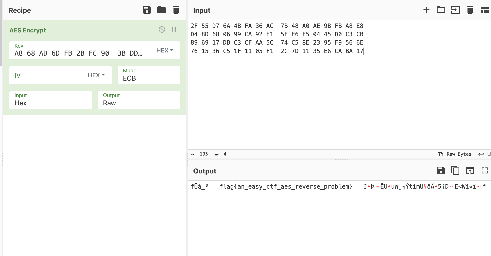

大作业1: 恶意软件分析wp

一、base64

此题目根据逆向结果，可以看出是进行了base64加密。但是使用的table并不是常用的table，而是进行了一定的修改。

题目代码将flag换表然后加密，得到一个字符串，如果加密后结果和内存某个地址处已经写入的字符串相同，就认为这个flag是题目需要的flag。

因此，得到exp如下：

```python
import base64
str1 = "TL0PTWxbkwNvNaRsyMeP6gNrkwRvwWRPkL0vwKNP6vqbT/qa3Q9BTK/YsDzz"

string1 = "18AtF9QM=ehJpNiZDRoIG/EwkT364yfs+PbaYvLg7uldrxBVC0njX2KWS5mUHqOcz"#修改之后的base64表
string2 = "ABCDEFGHIJKLMNOPQRSTUVWXYZabcdefghijklmnopqrstuvwxyz0123456789+/="

print(len(string1))
print(len(string2))

print(base64.b64decode(str1.translate(str.maketrans(string1,string2))))
```

运行得到flag为：
flag{base64_translate_table_can_be_changed}


二、aes

题目逆向后发现，sub_16E6先对输入进行了base64解码。然后函数sub_1369进行了某种计算，并将计算结果存在unk_4280处。接下来，要把计算结果和byte_2080处已经存下的数据进行比较，如果一致的话就得到了flag。

然后进入sub_1369函数，发现函数的功能是将asc_4010处的字节设置为密钥并进行AES加密。（某种程度上来说，是根据函数的名字得到的这一信息）

因此，解密的流程如下：

先把asc_4010处的结果取出来，这个就是密钥。

```python3
unk_4010=bytes.fromhex('''A8 68 AD 6D FB 2B FC 90  3B DD DC 3A 93 ED 37 89''')
```

然后将byte_2080处存的字节读出来，这个是计算结果。

```python3
byte_2080=bytes.fromhex('''
2F 55 D7 6A 4B FA 36 AC  7B 48 A0 AE 9B FB A8 E8
D4 8D 68 06 99 CA 92 E1  5F E6 F5 04 45 D0 C3 CB
89 69 17 DB C3 CF AA 5C  74 C5 8E 23 95 F9 56 6E
76 15 36 C5 1F 11 05 F1  2C 7D 11 35 E6 CA BA 17''')
```

然后使用cyperchef工具进行解密，可以得到flag为：
flag{an_easy_ctf_aes_reverse_problem}




三、pack

逆向发现程序符合加壳后程序的特征，因此使用Detect It Easy检查发现加了UPX壳。但是使用upx尝试unpack之后发现unpack失败了。这是为什么呢